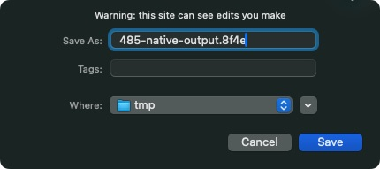

# TODO: Lazy-load Project Export Formatting

## Problem Description

The project-export effect eagerly imports the `.8f4e` text serializer even when the user never exports a project.
The same effect also owns session saving, so deferring the entire effect would interfere with persistence.

## Proposed Solution

Load `serializeProjectTo8f4e` when exporting a `.8f4e` file. Keep state-to-project serialization, session saving,
configuration registration, and lightweight export event handlers available immediately.

## Implementation Plan

1. Measure the serializer's contribution and inspect its imports and public re-export from `editor-state`.
2. Defer text serialization through a cached module loader while keeping autosave independent. Preserve the intended
   project snapshot and filename if state changes while export code loads.
3. Preserve save-picker user activation: acquiring a file handle may need to happen synchronously from the user action,
   before waiting for a network import. Adjust the export callback flow only as required and document any API change.
4. Cover cancellation and failure, and measure the production bundle and first-export behavior.

## Success Criteria

- [x] Normal startup and autosave do not load the `.8f4e` text formatter.
- [x] First and subsequent exports produce equivalent content and filenames for the captured project.
- [x] Session persistence, binary export, and screenshot export retain their behavior.
- [x] Native save pickers and the download fallback still work, including cancellation and delayed module loading.
- [x] Export errors are handled without unhandled rejections.
- [x] Final bundle inspection confirms no alternate eager import retains the formatter, and savings are recorded.

## Affected Components

- `packages/editor/packages/editor-core/packages/editor-state/src/features/project-export/effect.ts`
- `packages/editor/packages/editor-core/packages/editor-state/src/features/project-export/serializeTo8f4e.ts`
- `packages/editor/packages/editor-core/packages/editor-state/src/index.ts`
- `packages/editor/packages/editor-default/src/storage-callbacks.ts`

## Risks & Considerations

This is expected to be a smaller saving. Preserve the existing synchronous public serializer API unless changing it is
necessary and justified; its re-export and intermediate library bundles must be checked in the final consumer build.
Browser user activation can expire during an asynchronous load, making the file-picker flow a key validation point.

## Validation Checkpoints

- Run `npx nx run-many --target=test --projects=@8f4e/editor-state,@8f4e/editor-default` and corresponding typechecks.
- Run `npx nx run @8f4e/editor-website:build` and compare initial static dependency sizes.
- Manually test cold-load export with a native save picker and with the download fallback.
- Verify autosave before any export and focused serialization regression tests.

## Related Items

- [TODO 486: Lazy-load editing features on entering edit mode](../486-lazy-load-editing-features-on-edit-mode.md) — both must preserve shared session serialization.

## References

- [Project-export effect](../../../packages/editor/packages/editor-core/packages/editor-state/src/features/project-export/effect.ts)

## Notes

Identified through source inspection on 2026-09-06. Prioritize background rendering and menu builders before this smaller split.

## Implementation Results

The export effect captures a deep project snapshot, filename, and callbacks before awaiting a shared formatter
loader. Session serialization/autosave and lightweight event/configuration registration remain eager. Export
failures are caught, failed imports can be retried where supported by the browser, and disposal cancels exports
still waiting for a destination or formatter.

The optional `prepareProjectExport(fileName)` callback acquires a destination during the input handler and returns
a text writer, or `undefined` on cancellation. The default composition opens its native picker before loading the
formatter and does not create a writable until formatting succeeds. Download fallback captures the filename in a
writer closure. Existing string-based export callbacks remain supported; custom native-picker hosts should use the
preparation callback to preserve user activation across a cold import.

The public synchronous `serializeProjectTo8f4e` export is unchanged. `editor-state` now builds a second formatter
entry, allowing downstream tree-shaking of that public re-export. With a single library entry, Vite folded the
formatter back into startup code despite the dynamic import. Final website inspection confirms that the formatter
and its export-only validation/format helpers now reside in one deferred chunk; shared compiler/session code was
not moved to inflate the saving.

### Production Measurements

Compared production editor-website builds from `c90b09b93` and this change, using Node 24.16.0 on 2026-09-06.
The baseline includes the pre-existing working-tree changes and excludes the separate TODO 484 PR. Initial bytes
include the entry and its transitive static manifest imports; workers and dynamic assets are excluded. Gzip sizes
use Node zlib's default level 6 and describe artifacts, not measured HTTP transfer sizes.

| Measurement | Before | After | Difference |
| --- | ---: | ---: | ---: |
| Initial static JavaScript | 290,289 B | 289,473 B | −816 B (0.28%) |
| Initial static JavaScript, gzip | 80,956 B | 80,723 B | −233 B (0.29%) |
| Deferred formatter | — | 1,877 B | One request on first export |
| Deferred formatter, gzip | — | 818 B | — |
| First-export median | 0.860 ms | 31.595 ms | +30.735 ms |
| Subsequent-export median | 0.470 ms | 0.495 ms | No extra formatter request |

Latency measurements used five fresh headless Chromium contexts per build, an idle test runner, the default project,
and localhost without CPU/network throttling. Timing runs from the Export Project mousedown event to creating the
text Blob URL; it excludes physical input, download completion, and native-picker interaction. First-export ranges
were 0.765–1.035 ms before and 21.565–44.285 ms after. These local results do not predict remote-network latency.

The final website emits `assets/chunks/serializeTo8f4e-DdY0ESOq-DawutyPz.js` as a dynamic entry. No formatter chunk
was requested during startup or autosave. Each fresh context requested it once on first export and never again on
subsequent export. Downloaded contents and suggested filenames matched before/after and across repeated exports.

### Validation Results

- Editor-state tests: 154 files, 1,118 tests passed, including the existing serializer regression suite.
- Editor-default tests: 7 files, 47 tests passed.
- Both package typechecks and the production editor-website build passed; changed TypeScript passed Biome.
- Importing the built public serializer and calling it synchronously returned the expected `.8f4e` string.
- Focused tests cover autosave independence, nested snapshots, captured filenames/callbacks, destination preparation
  before importing, cancellation, recoverable load failures, serialization errors, synchronous callback errors,
  disposal, repeated exports, native writes, fallback URL cleanup, binary exports, and screenshots.
- Production fallback checks confirmed autosave before first export, identical repeated downloads, and preservation
  of the original content/filename while the formatter request was held and live state changed.
- Native Chromium save-picker opening and cancellation were verified through the macOS UI; cancellation did not
  request the formatter. Full native saving with a delayed formatter was attempted, but the test browser closed
  before completion. Native file-handle writes are covered by unit tests; full native save completion remains a
  manual validation limitation.

## Archive Instructions

Set `status: Completed` and the completion date, move this file to `docs/todos/archived/`, and update `docs/todos/_index.md`.
